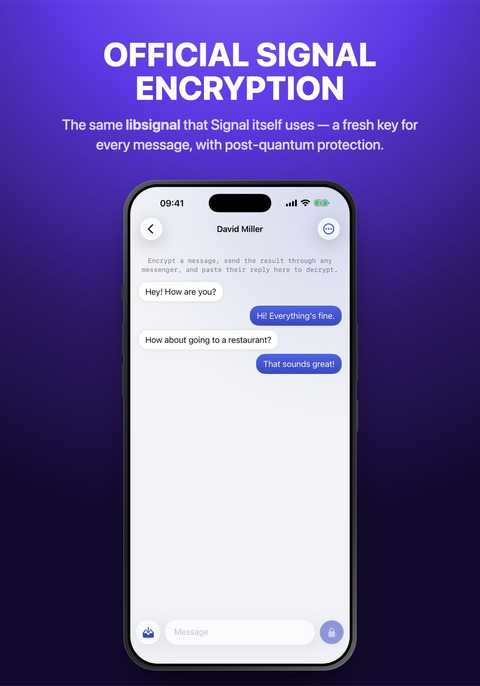
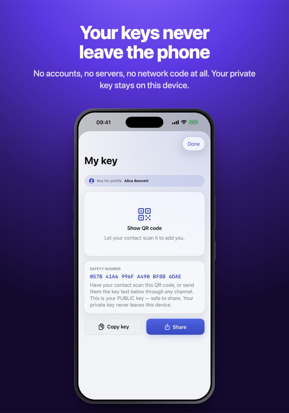
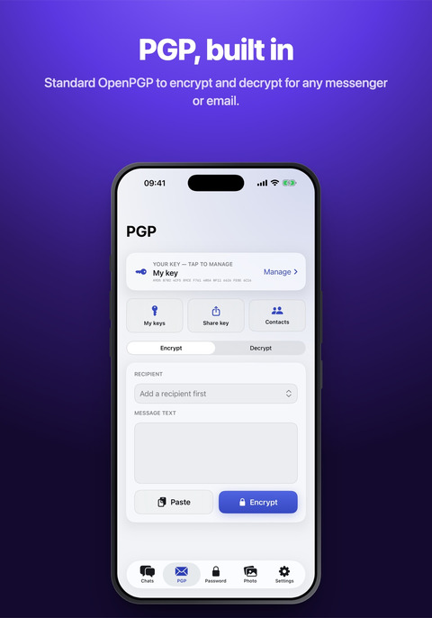
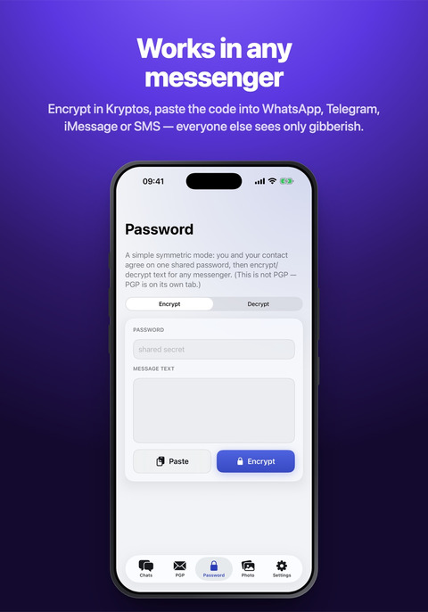
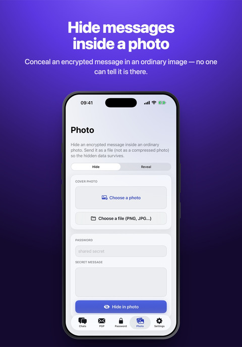

<div align="center">

<picture>
  <source media="(prefers-color-scheme: dark)" srcset="assets/banner-dark.png">
  
</picture>

<sub>[Русский](README.ru.md) &nbsp;·&nbsp; [Website](https://datakeeper.pages.dev/kryptos) &nbsp;·&nbsp; [News](https://t.me/KryptosApp) &nbsp;·&nbsp; [Privacy policy](https://datakeeper.pages.dev/kryptos/privacy)</sub>

<br>

<a href="fastlane/metadata/android/en-US/images/phoneScreenshots/1.jpg"></a><a href="fastlane/metadata/android/en-US/images/phoneScreenshots/2.jpg"></a><a href="fastlane/metadata/android/en-US/images/phoneScreenshots/3.jpg"></a><a href="fastlane/metadata/android/en-US/images/phoneScreenshots/4.jpg"></a><a href="fastlane/metadata/android/en-US/images/phoneScreenshots/5.jpg"></a>

</div>

# [Kryptos](https://datakeeper.pages.dev/kryptos)

[](https://github.com/swisslite/Kryptos/releases/latest)
[](https://f-droid.org/packages/com.kryptos.android/)
[](LICENSE)
[](#support-the-project)

Kryptos is an iPhone and Android app that encrypts conversations inside any messenger.

You type the message straight into WhatsApp, Telegram or an SMS, tap the padlock on the Kryptos
keyboard, and the field holds ciphertext instead of your text. On the other end it works the other
way round: on Android Kryptos decrypts the text on screen without leaving the messenger, on iPhone
it shows the text above the keyboard once the ciphertext is copied. The messenger, the carrier and
anyone who intercepts the message on the way see a run of characters they cannot read.

The app is the same on both systems and uses one format, so it does not matter which phone your
contact carries.

## Features

- The Kryptos keyboard installs like any ordinary system keyboard and encrypts the text right in the input field of any app
- It is a full keyboard as well: five layouts, emoji, completions and autocorrection for English, Russian, German and Persian, and pinyin input for Chinese, all of it working offline
- On Android the ciphertext is decrypted right on screen, over the message in the chat. Nothing has to be copied or opened separately - the conversation reads like an ordinary one. The feature works only with your contacts and is off by default
- Conversations run on the Signal Protocol: a new key is created for every message, and the initial key exchange is protected even against future quantum computers
- You exchange keys with a contact once, by QR code or as a string. Several profiles can be kept in the app
- If a key exchange is not wanted, a shared-password mode is available. PGP is built in as well, for those who work with it
- Photo steganography: the ciphertext hides inside an ordinary picture, and the file gives no way to tell that anything is in it
- Text steganography disguises the ciphertext as harmless text: a run of words, connected sentences, or an unbroken run of letters
- Length masking pads messages to fixed sizes, so the length of the ciphertext does not give away the length of the original
- Unlock by fingerprint or face and a separate app passcode. There is also a panic password: instead of opening the app it erases every key, chat and contact
- The clipboard clears itself, messages can be deleted on a timer, and screenshots can be blocked on Android
- Every key can be exported into one password-protected file and restored on a new phone
- The app language is set apart from the system one, there are light and dark themes, and a built-in walkthrough answers the common questions

## Requirements

- iOS 17 or newer
- Android 8.0 (API 26) or newer, `arm64-v8a` or `armeabi-v7a`

## Installation

**F-Droid** — [f-droid.org/packages/com.kryptos.android](https://f-droid.org/packages/com.kryptos.android/).
The app is built there from source and signed with the same key as the APK in the releases, so it
installs over an existing copy and updates itself.

**Android, direct** — `Kryptos.apk` from the [releases](../../releases) or from the
[website](https://datakeeper.pages.dev/kryptos). The file is signed with the developer's own key
rather than a store's, so the phone has to allow installing unknown apps. Updates then have to be
installed by hand.

**iOS** — `Kryptos.ipa` comes unsigned and has to be signed by you. There are two ways:

- with your own certificate (a `.p12` and a provisioning profile), open the `.ipa` in Feather, ESign
  or Scarlet and install it from there;
- without one, add the [AltStore-format repository](https://datakeeper.pages.dev/altstore.json) to
  AltStore or SideStore: they sign the app with your Apple ID. That signature lasts 7 days and is
  renewed with Refresh in the same app.

Sign an update with the same certificate as the previous install, otherwise the keychain access
group changes and the app starts as a fresh install. SHA-256 checksums are published with every
release and on the website.

## Usage

1. Open the Chats tab and show your contact your key: My key, then Show QR code, or copy it as a string. Add their key with Add contact.
2. Write the message in the app or on the Kryptos keyboard and encrypt it.
3. Send the resulting block through any messenger.
4. The recipient reads it in the app, in the keyboard, or on screen on Android.

Password mode and PGP mode do without the first step: password mode needs only a word the two of you
agreed on, PGP needs the recipient's public key.

## Support the project

If Kryptos is useful to you, you can support its development. The same three addresses are in the
app itself, under Settings.


```
86oyPpT7CitPFQTxWdwYwSZ9BUABib37G9AQeeYd2KRcFfwbamaUiZfJYC8gPrfTCiV2X7K4DC1XFi3cfX6N1d1uUL5s3jh
```


```
UQDrhHMQy8-mZ7pq9KerKAd7QUwjCXjNK-20f0m4yjOkL8jF
```


```
bc1qwsnex9q5ux88fnt93udn2xmf8752mnx4km2rvm
```

## Security

- **Signal Protocol** — the official [libsignal](https://github.com/signalapp/libsignal) v0.96.4,
  built from source on both platforms. PQXDH (X3DH with Kyber-1024) for the initial agreement and the
  Triple Ratchet for the conversation itself — the Double Ratchet with Signal's post-quantum SPQR
  mixed into the key of every message. Signed and Kyber prekeys are rotated every two days, and
  retired generations are deleted after 30 days.
- **Wire format** — `salt ‖ AES-256-CTR(HKDF-SHA256(pairKey, salt) → key/IV, header ‖ body)`,
  base64url, with no prefix and no plaintext header. Nothing in the output says that Kryptos produced
  it, and the same text gives a different result every time. DEFLATE compression and length padding
  are negotiated in a single header byte.
- **Password mode** — Argon2id, 64 MiB, t=3, p=1 (the RFC 9106 profile), then AES-256-GCM with a
  per-message random salt. On iOS this is the PHC reference implementation of Argon2, on Android it
  is Bouncy Castle; both are tested against the official vectors and against each other.
- **PGP** — ObjectivePGP on iOS, PGPainless and Bouncy Castle on Android.
- **Photo steganography** — carrier pixels are selected by local brightness variance in the red and
  green channels, which stay untouched, so both sides compute the same positions. Bits ride in
  the blue channel as LSB matching, placement comes from an HMAC-SHA256 keystream, and the length is
  masked. The container has no magic bytes and no plaintext header.
- **Key storage** — iOS Keychain with `kSecAttrAccessibleAfterFirstUnlockThisDeviceOnly`; Android
  Keystore with an AES/GCM master key: StrongBox is used when the device has it, and where the
  hardware supports it the key only works while the phone is unlocked.
- **Network** — neither app contains networking code. The Android manifest declares only `CAMERA`,
  `VIBRATE` and `HIDE_OVERLAY_WINDOWS`: there is no `INTERNET` permission, so the app cannot reach the
  network. There are no accounts, no phone numbers and no servers either.
- **Reporting a vulnerability** — privately, as described in [SECURITY.md](SECURITY.md).
- **Android hardening** — `FLAG_SECURE` on the app and keyboard windows, personalized learning
  disabled for third-party keyboards, anti-tapjacking, empty `taskAffinity`, backups and
  device-to-device transfer disabled, R8 shrinking and obfuscation. The panic wipe destroys the
  Keystore master key, so data left in flash cannot be decrypted.

libsignal ships a networking module that Kryptos never calls. It is present in the binary, but no
execution path reaches it.

## Architecture

```
CipherCore/         Swift package: Argon2id, password mode, steganography, wire format, tests
Kryptos/            iOS app (SwiftUI): chats, PGP, password mode, steganography, settings
KryptosKeyboard/    iOS keyboard (an app extension) together with its dictionaries
android/app/        Android app (Kotlin, Jetpack Compose)
  core/               the Kotlin counterpart of CipherCore
  signal/ pgp/        protocol services and stores
  keyboard/           the IME
  screen/             the on-screen decryption service
android/libsignal/  local module that compiles libsignal for Android
ThirdParty/         ObjectivePGP (prebuilt xcframework)
patches/            the patch applied to libsignal
scripts/            setup-libsignal.sh
```

The libsignal sources are not part of this repository. The `scripts/setup-libsignal.sh` script clones
them at the pinned tag, applies `patches/libsignal-v0.96.4-kryptos.patch` (an Android ByteBuffer cast
and the removal of swift-docc-plugin) and builds the library.

## Development

```bash
scripts/setup-libsignal.sh --ios --android
./build-ipa.sh
cd android && ./gradlew :app:assembleRelease
```

Building libsignal needs the Rust toolchain, CMake, protoc and Clang with libclang. The detailed
instructions are in [BUILDING.md](BUILDING.md).

## License

AGPL-3.0, required by libsignal. The licence text is in [LICENSE](LICENSE).
