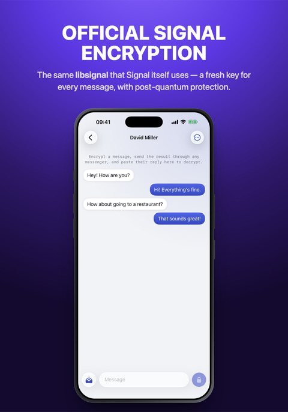
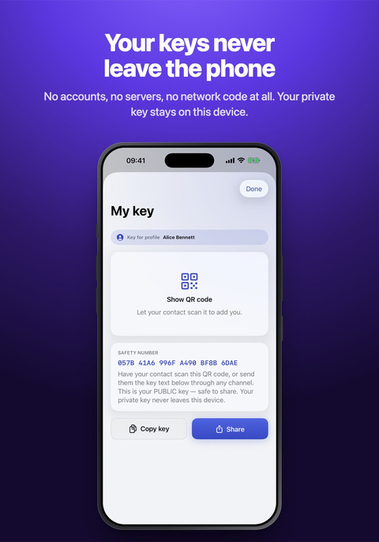
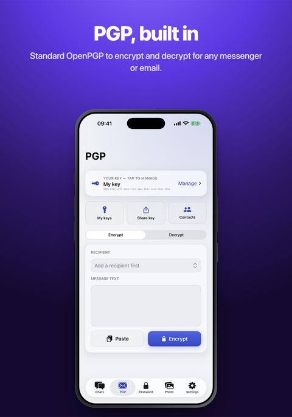
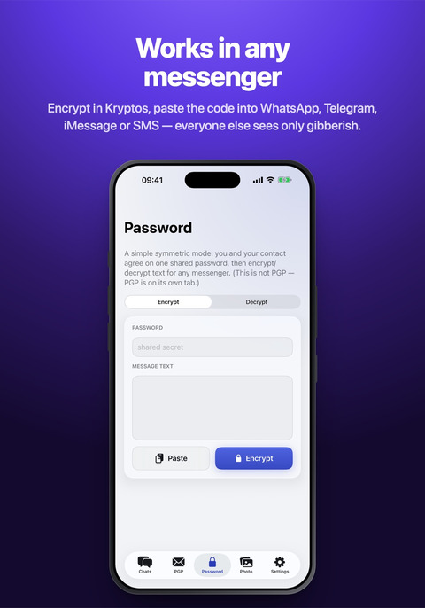
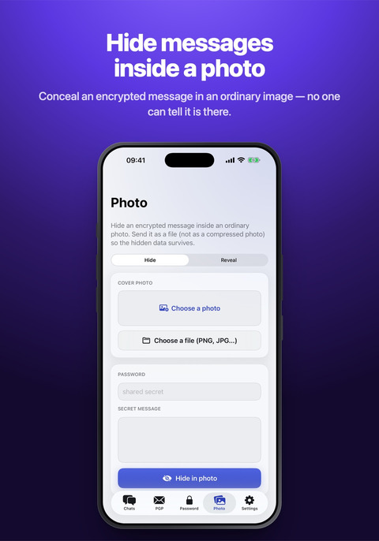

<div align="center">

<picture>
  <source media="(prefers-color-scheme: dark)" srcset="assets/banner-dark.png">
  
</picture>

<sub>[Русский](README.ru.md) &nbsp;·&nbsp; [Website](https://datakeeper.pages.dev/kryptos) &nbsp;·&nbsp; [News](https://t.me/KryptosApp) &nbsp;·&nbsp; [Privacy policy](https://datakeeper.pages.dev/kryptos/privacy)</sub>

<br>

<a href="fastlane/metadata/android/en-US/images/phoneScreenshots/1.jpg"></a><a href="fastlane/metadata/android/en-US/images/phoneScreenshots/2.jpg"></a><a href="fastlane/metadata/android/en-US/images/phoneScreenshots/3.jpg"></a><a href="fastlane/metadata/android/en-US/images/phoneScreenshots/4.jpg"></a><a href="fastlane/metadata/android/en-US/images/phoneScreenshots/5.jpg"></a>

</div>

# [Kryptos](https://datakeeper.pages.dev/kryptos)

[](https://github.com/swisslite/Kryptos/releases/latest)
[](https://f-droid.org/packages/com.kryptos.android/)
[](LICENSE)
[](#support-the-project)

Kryptos is an iOS and Android application that allows you to encrypt messages in regular messengers.
It also works with messengers where end-to-end encryption is not enabled by default, including
Telegram, Instagram, WeChat, as well as regular SMS.

You can write a message in any messenger and encrypt it using the “lock” button on the Kryptos
keyboard. The ciphertext will appear in the messenger’s input field and can be sent as a regular
message.

On Android, Kryptos can decrypt a message directly in the messenger’s chat, so you do not need to
constantly open Kryptos to decrypt messages. On iPhone, the decrypted text is automatically displayed
in the keyboard after copying the ciphertext.

Kryptos uses the same ciphertext format on both platforms, so the sender and recipient can use
different operating systems.

## Features

- System keyboard. Kryptos is installed as a regular system keyboard and allows you to encrypt text directly in the input field of any application. The keyboard supports multiple languages, emojis, suggestions, and autocorrect. It works without internet access.
- Decryption on Android. Ciphertext received from a contact is automatically decrypted over the messages in the messenger itself. Accessibility access is disabled by default.
- Signal Protocol. A separate key is used for each message (SPQR and Triple Ratchet), with protection for the initial key exchange against potential future attacks using quantum computers (PQXDH).
- Key exchange. The key is shared with the recipient once, either via a QR code or by copying the key. The recipient must do the same. Multiple profiles can be created in the application.
- Shared password. A shared password can be used instead: agree on a password with another person and use it to exchange information (symmetric encryption). PGP is also supported.
- Image steganography. Hiding a message inside an image.
- Text steganography. Masking ciphertext as an ordinary sequence of words instead of encrypted-looking text. Several text steganography modes are available.
- Length padding. A message can be padded to a specified size so that the length of the ciphertext does not reveal the exact length of the original message to outside observers.
- Application protection. You can use a fingerprint, face recognition, or a separate application code to log in. A duress password is also available: entering it does not open the application and instead deletes the keys, chats, and contacts.
- Clipboard and messages. The clipboard is cleared automatically. Messages can be deleted after a set amount of time. On Android, screenshots can be disabled.
- Backup. All keys and, optionally, chats can be exported to a password-encrypted file and transferred to another device.
- Interface settings. Multiple languages are supported. Light and dark themes are available, as well as a built-in usage guide with answers to common questions.

## Requirements

- iOS 17 or later
- Android 8.0 (API 26) or later
- Android: `arm64-v8a` or `armeabi-v7a`

## Installation

**F-Droid**: [f-droid.org/packages/com.kryptos.android](https://f-droid.org/packages/com.kryptos.android/).
The application is built in F-Droid from source code and signed with the same key as the APK from
Releases. Updates are installed through F-Droid.

**Android, direct**: `Kryptos.apk` from [Releases](../../releases) or the
[website](https://datakeeper.pages.dev/kryptos). The file is signed with the developer’s key, so you
will need to allow installation from unknown sources. Updates are installed manually.

**iOS**: `Kryptos.ipa` is unsigned and must be signed by you. There are two options:

- if you have a certificate (`.p12` and a provisioning profile), open the `.ipa` in Feather, ESign,
  or Scarlet and install it. Installation instructions can be found online;
- if you do not have a certificate, add the [AltStore-format repository](https://datakeeper.pages.dev/altstore.json)
  to AltStore or SideStore. They sign the application using your Apple ID. The signature is valid for
  7 days and can be renewed using the Refresh button in the same application.

When updating, use the same certificate as for the previous installation. Otherwise, the Keychain
access group will change and the application will launch as a new installation. SHA-256 checksums are
published with each release and on the website.

## How to use

1. Open the “Chats” tab and share your key with the recipient. To do this, select “My key” → “Show QR code” or copy the key and send it to the recipient.
2. Add the recipient’s key using “Add contact”.
3. Write a message in the application or in a messenger using the Kryptos keyboard and encrypt it.
4. Send the resulting ciphertext through any messenger.
5. The recipient can decrypt it in the application, in the keyboard after copying the ciphertext, or automatically on the screen in the messenger’s chat on Android (when on-screen decryption is enabled and accessibility access has been granted).

When using a shared password, key exchange is not required. You only need to agree on a password in
advance through a secure communication channel or in person.

## Support the project


```
86oyPpT7CitPFQTxWdwYwSZ9BUABib37G9AQeeYd2KRcFfwbamaUiZfJYC8gPrfTCiV2X7K4DC1XFi3cfX6N1d1uUL5s3jh
```


```
UQDrhHMQy8-mZ7pq9KerKAd7QUwjCXjNK-20f0m4yjOkL8jF
```


```
bc1qwsnex9q5ux88fnt93udn2xmf8752mnx4km2rvm
```

## Security

- **Signal Protocol**: [libsignal](https://github.com/signalapp/libsignal) v0.102.2, built from source
  on both platforms. PQXDH (X3DH with Kyber-1024) for the initial key agreement and Triple Ratchet for
  messaging. SPQR, Signal’s post-quantum protection, is mixed into the key for each message. Signed
  prekeys and Kyber prekeys are rotated every two days, and expired prekeys are deleted after 30 days.
- **Message format**: `salt ‖ AES-256-CTR(HKDF-SHA256(pairSecret, salt) → key/IV, header ‖ body)`,
  base64url, with no prefix or plaintext header. `pairSecret` is derived from the shared secret of the
  X25519 identity keys. The value transmitted through the messenger alone is insufficient to remove the
  masking. The ciphertext does not reveal that it was generated by Kryptos. The same plaintext produces
  a different ciphertext each time. DEFLATE compression and length padding are negotiated through a
  single header byte.
- **Password mode**: Argon2id, 64 MiB, t=3, p=1 (RFC 9106 profile), followed by AES-256-GCM with a
  random salt for each message. On iOS, Argon2 is provided by PHC; on Android, by Bouncy Castle. Both
  implementations are verified against test vectors and cross-checked against each other.
- **PGP**: ObjectivePGP on iOS, PGPainless and Bouncy Castle on Android.
- **Photo steganography**: carrier pixels are selected based on local brightness variation in the red
  and green channels, which remain untouched, so both sides calculate the same positions. Bits are
  embedded in the blue channel using LSB matching, with the placement derived from an HMAC-SHA256
  stream. The payload length is concealed. The container contains no signatures or plaintext header.
- **Key storage**: Keychain on iOS with `kSecAttrAccessibleWhenUnlockedThisDeviceOnly`; Android
  Keystore with an AES/GCM master key. StrongBox is used when available on the device, and where
  supported, the key is only usable while the phone is unlocked.
- **Network**: no networking code is included in any version. The Android manifest declares only the
  permissions required for operation; the `INTERNET` permission is not requested. There are no
  accounts, phone numbers, or servers.
- **Report a vulnerability or bug**: The reporting procedure is described in [SECURITY.md](SECURITY.md).
- **Android protection**: `FLAG_SECURE` for app and keyboard windows, disabled personalized learning
  by third-party keyboards, tapjacking protection, an empty `taskAffinity`, disabled backups and
  device-to-device transfer, R8 shrinking and obfuscation. Emergency wipe destroys the master key in
  the Keystore, making the remaining data undecryptable.

## Architecture

```
CipherCore/         Swift package: Argon2id, password mode, steganography, wire format
Kryptos/            iOS app (SwiftUI): chats, PGP, password mode, steganography, settings
KryptosKeyboard/    iOS keyboard (an app extension) together with its dictionaries
android/app/        Android app (Kotlin, Jetpack Compose)
  core/               the Kotlin counterpart of CipherCore
  signal/ pgp/        protocol services and stores
  keyboard/           the IME
  screen/             the on-screen decryption service
android/libsignal/  local module that compiles libsignal for Android
ThirdParty/         ObjectivePGP (prebuilt xcframework)
patches/            the patch applied to libsignal
scripts/            setup-libsignal.sh
```

The libsignal sources are not part of this repository. The `scripts/setup-libsignal.sh` script clones
them at the pinned tag, applies `patches/libsignal-v0.102.2-kryptos.patch` (the removal of
swift-docc-plugin) and builds the library.

## Development

```bash
scripts/setup-libsignal.sh --ios --android
./build-ipa.sh
cd android && ./gradlew :app:assembleRelease
```

Building libsignal needs the Rust toolchain, CMake, protoc and Clang with libclang. The detailed
instructions are in [BUILDING.md](BUILDING.md).

## License

AGPL-3.0, required by libsignal. The licence text is in [LICENSE](LICENSE).
