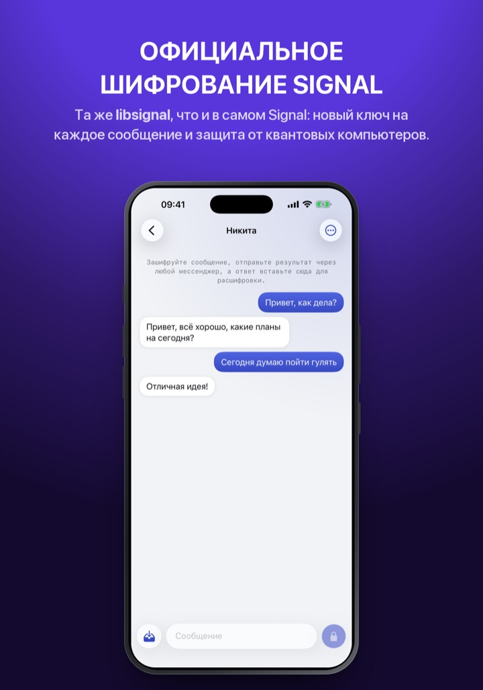
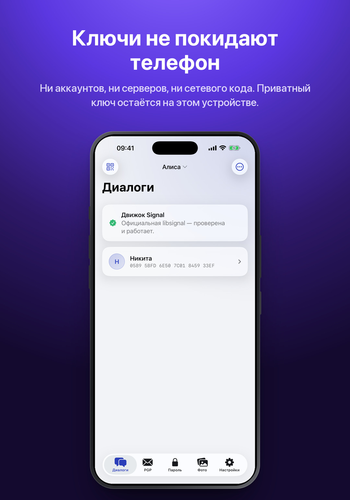
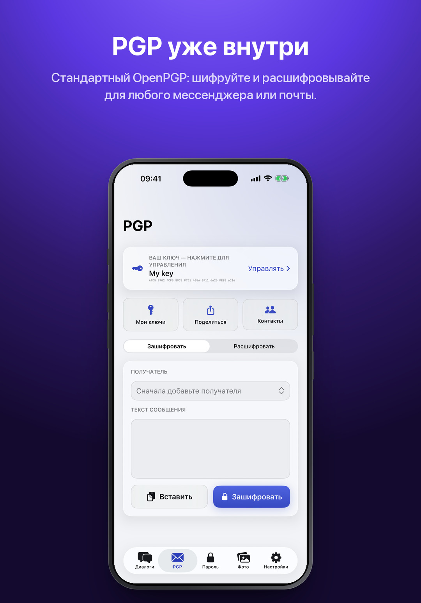
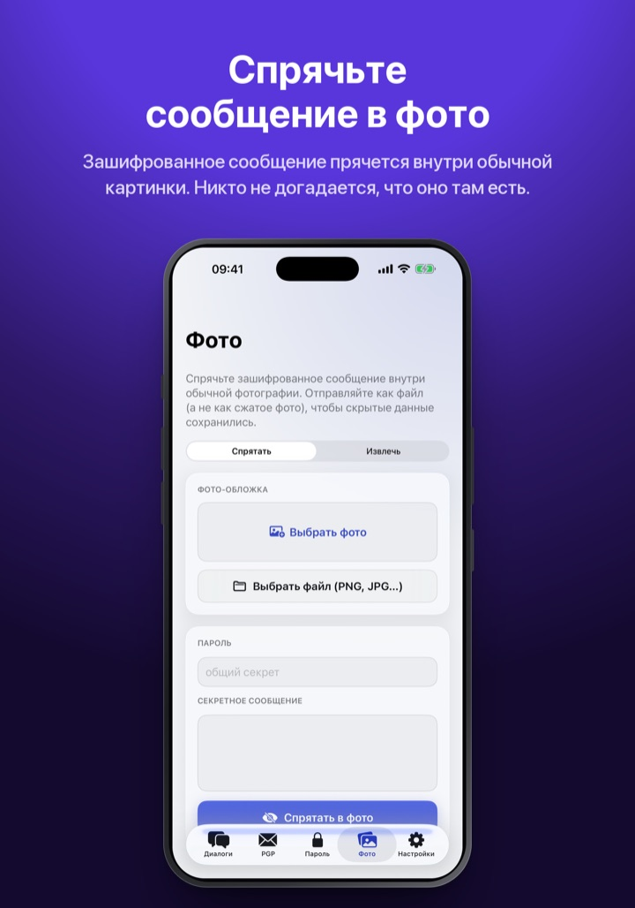

# Kryptos 🔐

[English](README.md) · **Русский**

**Шифруйте где угодно. Общайтесь по любому каналу.**

Kryptos — приложение сквозного шифрования для **iOS и Android**, которое работает *поверх* любого
мессенджера или SMS. Вы шифруете сообщение в Kryptos (или прямо на его клавиатуре), вставляете
получившийся код в WhatsApp / Telegram / iMessage / Signal / VK / SMS / что угодно, а собеседник
расшифровывает его своим Kryptos. Мессенджер несёт лишь то, что выглядит как случайный шум, —
открытый текст его никогда не касается.

Без аккаунтов. Без номера телефона. Без серверов. Без телеметрии. В приложении **вообще нет
сетевого кода** (сборка для Android идёт без разрешения `INTERNET`), а ключи создаются на устройстве
и никогда его не покидают.

**iOS и Android полностью равноправны**: нативные на обеих платформах (SwiftUI / Jetpack Compose) и
совместимы байт-в-байт — айфон и андроид общаются без разницы, поэтому неважно, какой телефон у вас
или у собеседника. И всё это сделано, чтобы **пользоваться каждый день, а не только ради «особых»
секретных сообщений**: зашифровать — одно нажатие, и код уже в буфере обмена; ответ расшифровывается
прямо на экране или в клавиатуре, не выходя из чата. Не нужно уговаривать друзей ставить новый
мессенджер и ничего не нужно настраивать — Kryptos встраивается в те мессенджеры, которыми вы и так
пользуетесь целый день.

- 🌍 Сайт и документация: <https://datakeeper.pages.dev/kryptos>
- 📣 Новости: Telegram [@KryptosApp](https://t.me/KryptosApp)

## Скачать

- **F-Droid** — [f-droid.org/packages/com.kryptos.android](https://f-droid.org/packages/com.kryptos.android/).
  F-Droid собирает Kryptos из исходного кода, и сборка подписана тем же ключом, что и файлы здесь,
  поэтому она встаёт поверх уже установленного приложения, ничего не удаляя, а обновления приходят
  сами. Самый простой путь на Android.
- **Android, напрямую** — `Kryptos.apk` из любого [релиза](../../releases) или с
  [сайта](https://datakeeper.pages.dev/kryptos), самоподписанный. Разрешите «установку из неизвестных
  источников», минимум Android 8.0. Обновления в этом случае вручную.
- **iOS** — `Kryptos.ipa`, **без подписи**, минимум iOS 17. Какой способ нужен, зависит от того, есть
  ли у вас свой сертификат для подписи:
  - **Если сертификат есть** (`.p12` и профиль) — откройте скачанный `.ipa` в Feather, ESign или
    Scarlet и нажмите установить. Компьютер для этого не нужен.
  - **Если сертификата нет** — добавьте
    [репозиторий в формате AltStore](https://datakeeper.pages.dev/altstore.json) в AltStore или
    SideStore. Они подписывают приложения вашим обычным Apple ID, покупать ничего не нужно: установка
    в одно нажатие, новые версии приходят сами. Подпись держится 7 дней и продлевается кнопкой
    Refresh в том же приложении.

Контрольные суммы SHA-256 публикуются с каждым релизом и на сайте. Хотите собрать сами?
См. [Сборка](#сборка).

## Скриншоты

| Сквозное шифрование | Обмен ключами | Режим PGP | Любой мессенджер | Стеганография |
|:---:|:---:|:---:|:---:|:---:|
|  |  |  |  |  |

## Чем Kryptos отличается

Большинство защищённых мессенджеров (Signal, Session, Threema…) — это **своя собственная сеть**:
чтобы всё работало, оба собеседника должны сидеть в одном приложении. Классические же PGP-инструменты
оборачивают сообщение в заметный блок `-----BEGIN PGP MESSAGE-----`, который прямо кричит «этот
человек что-то прячет». Kryptos построен на другой идее:

- **Клавиатура, которая шифрует на месте.** Встроенная клавиатура (расширение для iOS / IME для
  Android) шифрует поле или расшифровывает буфер обмена **внутри любого приложения**, так что
  переключаться туда-сюда не нужно.

- **Читает сообщения прямо там, где они есть.** На **Android** Kryptos распознаёт свои сообщения в
  любом приложении и накладывает расшифрованный текст **прямо поверх шифртекста, пока вы листаете
  чат** — только для ваших контактов и никогда, пока приложение заблокировано. На **iOS**
  скопированное сообщение открывается уже расшифрованным. Сообщения находятся по *форме* токена,
  поэтому приклеенные мессенджером время, галочки или имя отправителя не ломают распознавание.

- **Работает поверх каналов, которыми вы уже пользуетесь.** Никакой «сети Kryptos» нет. Вы
  продолжаете пользоваться WhatsApp, Telegram, iMessage, Discord, почтой или обычными SMS — Kryptos
  просто превращает ваш текст в шифр перед отправкой и обратно в текст на другой стороне. Kryptos
  нужен только вам двоим; все и всё между вами видят лишь шифртекст.

- **Шифртекст выглядит как чистый случайный шум — без опознавательных меток.** Начиная с версии 2.1
  нет вообще никаких узнаваемых префиксов. Каждое сообщение «отбеливается» AES-256-CTR с ключом из
  HKDF-SHA256 по отпечаткам пары плюс свежая случайная соль, поэтому вывод неотличим от случайного,
  **скрывает даже тип сообщения и каждый раз выглядит совершенно по-другому** — даже если отправить
  один и тот же текст дважды. Внутри этого конверта — настоящий шифртекст Signal.

- **Настоящий протокол Signal, а не самодельная криптография.** Kryptos подключает официальную
  библиотеку Signal [`libsignal`](https://github.com/signalapp/libsignal) — **PQXDH** (постквантовый
  X3DH + Kyber) для начального рукопожатия и **Double Ratchet** для переписки: совершенно новый ключ
  на каждое сообщение, прямая секретность и самовосстановление, если ключ когда-либо
  скомпрометирован. Никаких переписанных заново реализаций и самопальных примитивов.

- **Опциональная маскировка длины.** Включите её — и каждый шифртекст дополняется до фиксированных
  «корзин» (64 / 128 / 256 …), так что длина больше не выдаёт размер вашего сообщения. Формат
  само-описательный, поэтому получатель снимает добивку независимо от своих настроек.

- **Два способа спрятать сообщение на виду (стеганография).** Спрячьте уже зашифрованные данные в
  младших битах обычной **фотографии** или замаскируйте их под безобидный набор **настоящих,
  грамматически связных слов и предложений** (EN, RU + DE) — так можно скрыть даже сам факт
  существования сообщения.

- **Одно и то же приложение — на любом телефоне.** Обе платформы — полноценные нативные приложения,
  а не порт с «урезанной» стороной: всё (чаты Signal, PGP, парольный режим, оба вида стеганографии,
  клавиатура) одинаково работает и на iOS, и на Android, и они точно совместимы между собой.

- **Достаточно простое, чтобы пользоваться каждый день.** Задумка была не про лабораторный
  инструмент для разовых секретов, а про удобство обычной переписки: шифрование в одно нажатие с
  авто-копированием, автоматическое определение и расшифровка входящих, крипто-панель прямо в
  клавиатуре, светлая и тёмная темы, язык приложения отдельно от системного и встроенное руководство
  с ответами на вопросы. Сильная криптография, которая не мешается под ногами.

## Три способа шифровать

| Режим | Обмен ключами | Для чего лучше |
|------|--------------|----------|
| **Чат Signal** | одноразовый обмен ключами (QR или текст), дальше автоматически | постоянная приватная переписка с контактом |
| **Пароль (Быстро)** | не нужен — только общий пароль | быстрый секрет с новым человеком (Argon2id 64 МиБ / t=3 / p=1 → AES-256-GCM) |
| **PGP** | обмен открытыми ключами | совместимость с существующими схемами OpenPGP (подпись + шифрование) |

## Как это работает

1. **Напишите и зашифруйте** — наберите текст в Kryptos или на его клавиатуре; одно нажатие
   превращает его в код.
2. **Отправьте куда угодно** — вставьте код в любой чат. Для всех остальных это просто случайные
   символы.
3. **Расшифровка на экране** — Kryptos у собеседника покажет настоящий текст (живое наложение на
   Android или одно нажатие / автоматически на скопированном сообщении на iOS).

## Под капотом

- **Протокол Signal** через официальный `libsignal` v0.96.4 (PQXDH + Double Ratchet, префключи
  Kyber, одноразовые префключи, ротация) — собирается из исходников и линкуется в каждое приложение.
- **Формат провода v2** — `соль ‖ AES-256-CTR(HKDF-SHA256(pairKey, соль) → ключ/IV, заголовок ‖
  тело)`, base64url, без префикса; опциональные DEFLATE-сжатие и добивка до фиксированных корзин —
  всё согласуется одним байтом заголовка.
- **Парольный режим** — Argon2id (64 МиБ, t=3, p=1, профиль RFC 9106) → AES-256-GCM, случайная соль
  на каждое сообщение, DEFLATE где это уменьшает размер.
- **Стеганография в фото** — адаптивный LSB matching по ключу в синем канале, позиции выбираются по
  нетронутым красному и зелёному каналам, чтобы обе стороны сошлись, длина маскируется, открытой
  сигнатуры нет вообще, поэтому без пароля в контейнере не за что зацепиться.
- **Совместимость по проводу между платформами** — сообщения, строки ключей, парольные блобы,
  спрятанный-в-словах текст и стего-фото расшифровываются между iOS и Android; это доказано
  модульными тестами, которые декодируют векторы, созданные на другой платформе.
- **Умная офлайн-клавиатура** — контекстные подсказки и автокоррекция из встроенных словарей
  (~360 тыс. русских / ~177 тыс. немецких / ~110 тыс. английских словоформ), обучение на устройстве, хранение в
  зашифрованном виде, отключается в полях пароля. Без сети, никогда.

## Безопасность и приватность

- **Полностью офлайн** — ни серверов, ни аккаунтов, ни номеров телефона, ни аналитики, ни
  метаданных; ключи живут в **Keychain** (iOS) / **Android Keystore** (с приоритетом StrongBox) и
  никогда не синхронизируются и не покидают устройство.
- **Блокировка приложения** — Face ID / биометрия плюс шторка приватности в переключателе
  приложений, чтобы снимок никогда не показывал ваши чаты.
- **Гигиена буфера обмена** — авто-очистка через заданное время; скопированное помечается как
  конфиденциальное, чтобы не попадать в историю.
- **Несколько личностей** — создание, переключение, переименование, перегенерация ключа и удаление
  отдельных профилей.
- **Коды на экране блокировки** — необязательный **код приложения**, который открывает Kryptos, и
  **пароль-ловушка**, который вместо этого безвозвратно стирает всё: ключи, переписку, контакты,
  PGP-ключи, выученные слова, кэши и настройки. Оба вводятся в одно и то же поле, поэтому по его
  наличию нельзя понять, задан ли пароль-ловушка, а проверка занимает одинаковое время в любом
  случае.
- **Резервная копия ключей** — профили, закрытые ключи, ключи контактов и PGP-ключи выгружаются в
  один файл под паролем (Argon2id → AES-256-GCM) и восстанавливаются на новом телефоне. Переписка в
  копию намеренно не входит.
- **Исчезающие сообщения** — необязательный таймер для чата: по истечении срока сообщения стираются,
  включая копии в кэшах клавиатуры и экранной панели.
- **Усиление защиты на Android** — блокировка скриншотов и снимков в переключателе приложений
  (`FLAG_SECURE`); защита от tapjacking и перехвата задачи (StrandHogg); предупреждения о целостности
  устройства (root / эмулятор / отладчик / фреймворк перехвата / пересобранный APK); резервные копии
  и перенос на другое устройство отключены; R8-сжатие и обфускация.

Сообщить об уязвимости приватно — см. [SECURITY.md](SECURITY.md).

## Структура репозитория

```
.
├── CipherCore/         Swift-пакет: парольный режим, стеганография, формат токена (с юнит-тестами)
├── Kryptos/            приложение iOS (SwiftUI): чаты Signal, PGP, пароль, стего в фото
├── KryptosKeyboard/    расширение-клавиатура для iOS (шифрование/расшифровка в любом приложении)
├── Kryptos.xcodeproj/  проект Xcode
├── android/            приложение Android (Kotlin + Jetpack Compose), совместимо по проводу с iOS
├── ThirdParty/
│   └── ObjectivePGP/   OpenPGP для iOS (готовый xcframework, MIT)
├── patches/            небольшой патч, который Kryptos накладывает на libsignal
├── scripts/            setup-libsignal.sh — скачать + пропатчить + собрать libsignal
├── build-ipa.sh        сборка неподписанного .ipa для iOS
└── BUILDING.md         полная инструкция по сборке
```

`libsignal` здесь **не вложен** в репозиторий (он под AGPL-3.0, а его артефакты сборки весят сотни
МБ). Он скачивается и патчится из настоящего апстрима на точно зафиксированной версии скриптом
`scripts/setup-libsignal.sh` — см. [BUILDING.md](BUILDING.md).

## Сборка

Большинству достаточно просто скачать из [Releases](../../releases). Сборка из исходников нужна
контрибьюторам, аудиторам и для упаковки (F-Droid собирает из исходников). Подробности в
**[BUILDING.md](BUILDING.md)**; вкратце:

```bash
scripts/setup-libsignal.sh --ios --android      # скачать + пропатчить + собрать библиотеку Signal
./build-ipa.sh                                  # iOS: неподписанный .ipa
cd android && ./gradlew :app:assembleRelease    # Android: APK
```

## Лицензия

Kryptos распространяется под лицензией **GNU Affero General Public License v3.0** — см.
[LICENSE](LICENSE).
