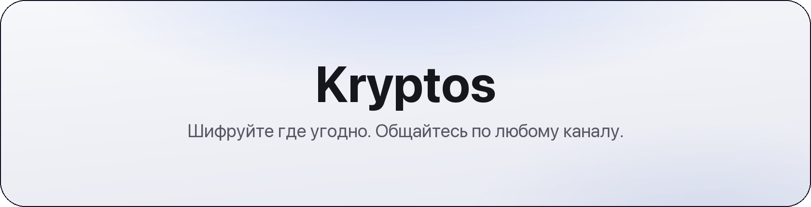
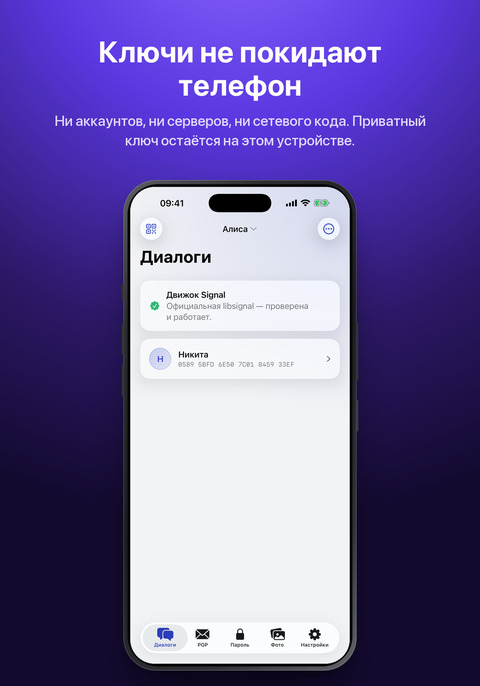
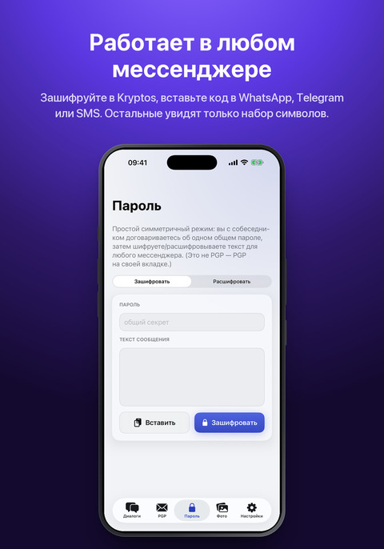
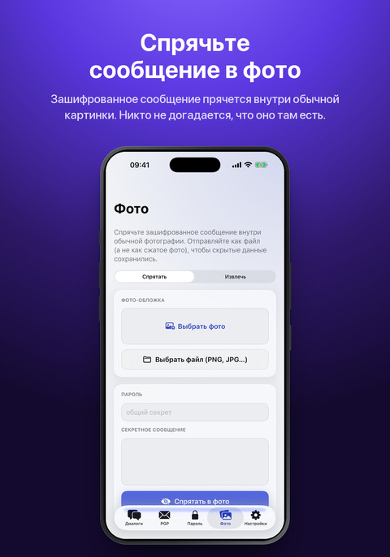

<div align="center">

<picture>
  <source media="(prefers-color-scheme: dark)" srcset="assets/banner-ru-dark.png">
  
</picture>

<sub>[English](README.md) &nbsp;·&nbsp; [Сайт](https://datakeeper.pages.dev/kryptos) &nbsp;·&nbsp; [Новости](https://t.me/KryptosApp) &nbsp;·&nbsp; [Политика конфиденциальности](https://datakeeper.pages.dev/kryptos/privacy)</sub>

<br>

<a href="fastlane/metadata/android/ru-RU/images/phoneScreenshots/1.jpg"></a><a href="fastlane/metadata/android/ru-RU/images/phoneScreenshots/2.jpg"></a><a href="fastlane/metadata/android/ru-RU/images/phoneScreenshots/3.jpg"></a><a href="fastlane/metadata/android/ru-RU/images/phoneScreenshots/4.jpg"></a><a href="fastlane/metadata/android/ru-RU/images/phoneScreenshots/5.jpg"></a>

</div>

# [Kryptos](https://datakeeper.pages.dev/kryptos)

[](https://github.com/swisslite/Kryptos/releases/latest)
[](https://f-droid.org/packages/com.kryptos.android/)
[](LICENSE)
[](#%D0%BF%D0%BE%D0%B4%D0%B4%D0%B5%D1%80%D0%B6%D0%B0%D1%82%D1%8C-%D0%BF%D1%80%D0%BE%D0%B5%D0%BA%D1%82)

Kryptos — приложение для iPhone и Android, которое шифрует переписку в любом мессенджере.

Вы набираете сообщение прямо в WhatsApp, Telegram или в SMS, нажимаете замок на клавиатуре Kryptos,
и вместо текста в поле остаётся шифр. У собеседника всё наоборот: на Android Kryptos расшифровывает
текст прямо на экране, не выходя из мессенджера, на iPhone показывает его над клавиатурой при
копировании шифротекста. Мессенджер, оператор и любой, кто перехватит сообщение по дороге, видят
только набор символов без возможности прочитать исходный текст.

Приложение одинаковое на обеих системах и использует один формат, поэтому неважно, какой телефон
у собеседника.

## Возможности

- Клавиатура Kryptos ставится как обычная системная и шифрует текст прямо в поле ввода любого приложения
- При этом она полноценная: подсказки, автоисправление, эмодзи и четыре раскладки. Русский, английский, немецкий и китайский с вводом по пиньиню, всё работает без интернета
- На Android шифр расшифровывается прямо на экране, поверх сообщения в чате. Ничего не нужно копировать или открывать отдельно - переписка читается как обычная. Функция доступна только для ваших контактов и по умолчанию отключена
- Переписка идёт по протоколу Signal: для каждого сообщения создаётся новый ключ, а начальный обмен ключами защищён даже от будущих квантовых компьютеров
- Ключами с собеседником обмениваются один раз, через QR-код или строкой. Профилей в приложении можно завести несколько
- Если обмен ключами не нужен, доступен режим общего пароля. Для тех, кто работает с PGP, встроен и он
- Стеганография в фото: шифр прячется внутри обычного снимка, и по файлу нельзя определить, что в нём что-то спрятано
- Текстовая стеганография маскирует шифр под безобидный текст: набор слов, связные предложения или сплошной поток букв
- Выравнивание длины дополняет сообщения до фиксированных размеров, чтобы длина шифра не указывала на длину исходного текста
- Вход по отпечатку или лицу и отдельный код приложения. Есть и пароль-ловушка: он не открывает приложение, а стирает все ключи, чаты и контакты
- Буфер обмена очищается сам, сообщения можно удалять по таймеру, а на Android ещё и запретить скриншоты
- Все ключи выгружаются в один файл под паролем, чтобы перенести их на новый телефон
- Язык приложения выбирается отдельно от системного, есть светлая и тёмная темы, а также встроенное руководство с ответами на частые вопросы

## Требования

- iOS 17 или новее
- Android 8.0 (API 26) или новее, `arm64-v8a` или `armeabi-v7a`

## Установка

**F-Droid** — [f-droid.org/packages/com.kryptos.android](https://f-droid.org/packages/com.kryptos.android/).
Приложение собирается там из исходного кода и подписано тем же ключом, что и APK в релизах, поэтому
устанавливается поверх уже имеющейся копии, ничего не удаляя, а обновления приходят автоматически.

**Android, напрямую** — `Kryptos.apk` из [релизов](../../releases) или с
[сайта](https://datakeeper.pages.dev/kryptos). Файл подписан ключом разработчика, а не магазина,
поэтому на телефоне придётся разрешить установку из неизвестных источников. Обновления в этом случае
ставятся вручную.

**iOS** — `Kryptos.ipa` поставляется без подписи, подписать его нужно самому. Способа два:

- если сертификат есть (`.p12` и профиль), откройте `.ipa` в Feather, ESign или Scarlet и установите
  оттуда;
- если сертификата нет, добавьте [репозиторий в формате AltStore](https://datakeeper.pages.dev/altstore.json)
  в AltStore или SideStore: они подписывают приложение вашим Apple ID. Такая подпись действует 7 дней
  и продлевается кнопкой Refresh в том же приложении.

Обновление подписывайте тем же сертификатом, что и предыдущую установку, иначе меняется группа
доступа к keychain и приложение запустится как установленное заново. Контрольные суммы SHA-256
публикуются с каждым релизом и на сайте.

## Как пользоваться

1. Откройте вкладку «Диалоги» и покажите собеседнику свой ключ: «Мой ключ» → «Показать QR-код», либо скопируйте его строкой. Ключ собеседника добавьте через «Добавить контакт».
2. Напишите сообщение в приложении или на клавиатуре Kryptos и зашифруйте его.
3. Отправьте получившийся блок через любой мессенджер.
4. Получатель прочитает его в приложении, в клавиатуре или прямо на экране на Android.

Режимы пароля и PGP обходятся без первого шага: для пароля достаточно слова, о котором вы
договорились, для PGP нужен открытый ключ получателя.

## Поддержать проект

Если Kryptos вам пригодился, можно поддержать разработку. Те же три адреса есть в самом
приложении, в настройках.


```
86oyPpT7CitPFQTxWdwYwSZ9BUABib37G9AQeeYd2KRcFfwbamaUiZfJYC8gPrfTCiV2X7K4DC1XFi3cfX6N1d1uUL5s3jh
```


```
UQDrhHMQy8-mZ7pq9KerKAd7QUwjCXjNK-20f0m4yjOkL8jF
```


```
bc1qwsnex9q5ux88fnt93udn2xmf8752mnx4km2rvm
```

## Безопасность

- **Протокол Signal** — официальная библиотека [libsignal](https://github.com/signalapp/libsignal)
  v0.96.4, собираемая из исходного кода на обеих платформах. PQXDH (X3DH с Kyber-1024) для начального
  согласования и Double Ratchet для самой переписки. Подписанные и Kyber-префключи обновляются каждые
  двое суток, отработавшие поколения удаляются через 30 дней.
- **Формат сообщения** — `соль ‖ AES-256-CTR(HKDF-SHA256(pairKey, соль) → ключ/IV, заголовок ‖
  тело)`, base64url, без префикса и без открытого заголовка. По шифру нельзя понять, что его сделал
  Kryptos, и один и тот же текст каждый раз даёт разный результат. Сжатие DEFLATE и выравнивание
  длины согласуются одним байтом заголовка.
- **Режим пароля** — Argon2id, 64 МиБ, t=3, p=1 (профиль RFC 9106), затем AES-256-GCM со случайной
  солью на каждое сообщение. На iOS это эталонная реализация Argon2 от PHC, на Android — Bouncy
  Castle; обе проверены официальными тестовыми векторами и сверены друг с другом.
- **PGP** — ObjectivePGP на iOS, PGPainless и Bouncy Castle на Android.
- **Стеганография в фото** — пиксели-носители выбираются по локальному перепаду яркости в красном и
  зелёном каналах, которые остаются нетронутыми, поэтому обе стороны вычисляют одни и те же позиции.
  Биты пишутся в синий канал методом LSB matching, расстановка берётся из потока HMAC-SHA256, длина
  маскируется. В контейнере нет ни сигнатур, ни открытого заголовка.
- **Хранение ключей** — Keychain на iOS с `kSecAttrAccessibleAfterFirstUnlockThisDeviceOnly`;
  Android Keystore с мастер-ключом AES/GCM: используется StrongBox, если он есть в устройстве, и там,
  где это поддерживается, ключ работает только на разблокированном телефоне.
- **Сеть** — сетевого кода нет ни в одном из приложений. Манифест Android объявляет только `CAMERA`,
  `VIBRATE` и `HIDE_OVERLAY_WINDOWS`: разрешения `INTERNET` там нет, поэтому выйти в сеть приложение
  не может. Аккаунтов, номеров телефона и серверов тоже нет.
- **Сообщить об уязвимости** — приватно, порядок описан в [SECURITY.md](SECURITY.md).
- **Защита на Android** — `FLAG_SECURE` для окон приложения и клавиатуры, отключённое
  персонализированное обучение сторонних клавиатур, защита от tapjacking, пустой `taskAffinity`,
  отключённые резервные копии и перенос между устройствами, сжатие и обфускация R8. Аварийное
  стирание уничтожает мастер-ключ в Keystore, поэтому оставшиеся данные расшифровать нельзя.

В libsignal есть сетевой модуль, который Kryptos не вызывает: он присутствует в бинарнике, но ни один
путь исполнения до него не доходит.

## Архитектура

```
CipherCore/         Swift-пакет: Argon2id, режим пароля, стеганография, формат сообщения, тесты
Kryptos/            приложение для iOS (SwiftUI): чаты, PGP, пароль, стеганография, настройки
KryptosKeyboard/    клавиатура для iOS (расширение) вместе со словарями
android/app/        приложение для Android (Kotlin, Jetpack Compose)
  core/               аналог CipherCore на Kotlin
  signal/ pgp/        службы протокола и хранилища
  keyboard/           клавиатура (IME)
  screen/             служба расшифровки на экране
android/libsignal/  локальный модуль, собирающий libsignal под Android
ThirdParty/         ObjectivePGP (готовый xcframework)
patches/            патч, применяемый к libsignal
scripts/            setup-libsignal.sh
```

Исходники libsignal в репозиторий не входят. Скрипт `scripts/setup-libsignal.sh` клонирует их на
закреплённом теге, применяет `patches/libsignal-v0.96.4-kryptos.patch` (приведение ByteBuffer для
Android и удаление swift-docc-plugin) и собирает библиотеку.

## Разработка

```bash
scripts/setup-libsignal.sh --ios --android
./build-ipa.sh
cd android && ./gradlew :app:assembleRelease
```

Для сборки libsignal нужны Rust, CMake, protoc и Clang с libclang. Подробные инструкции лежат в
[BUILDING.md](BUILDING.md).

## Лицензия

AGPL-3.0, этого требует libsignal. Текст лицензии в файле [LICENSE](LICENSE).
