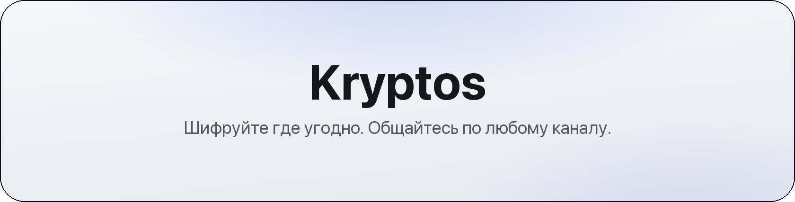
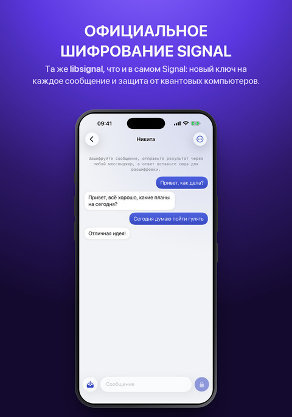
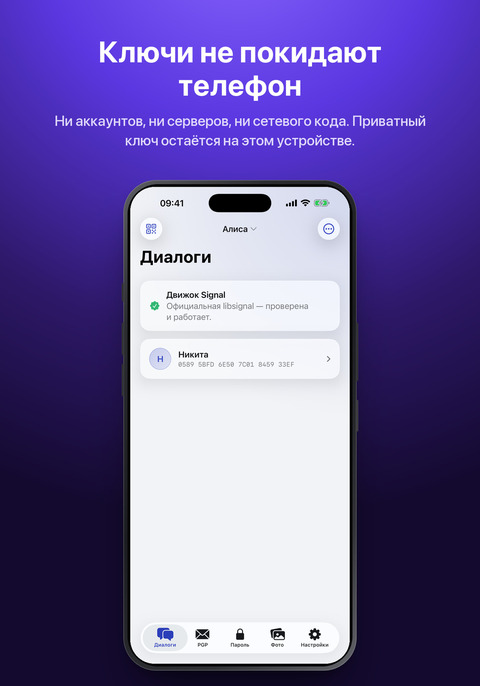
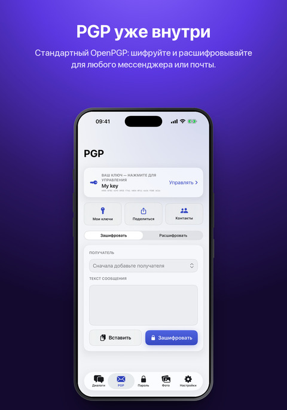
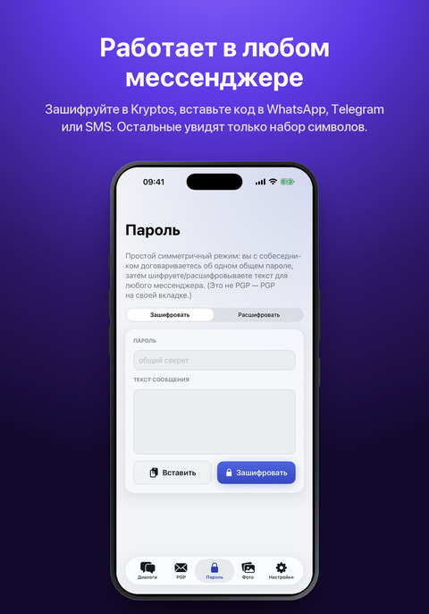
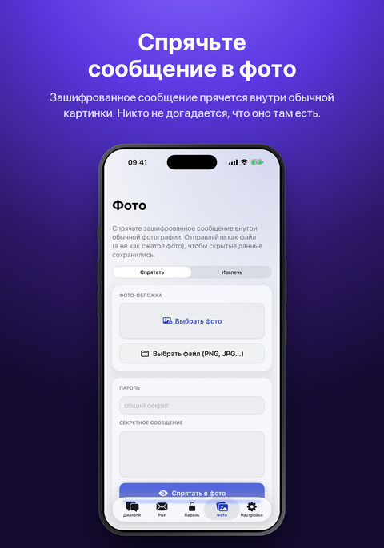
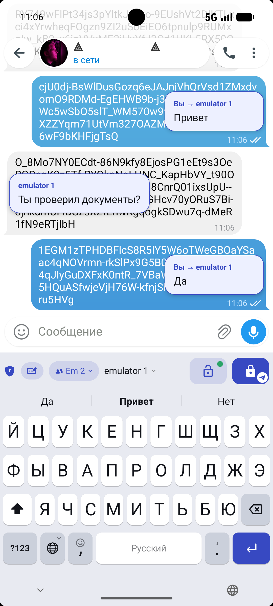
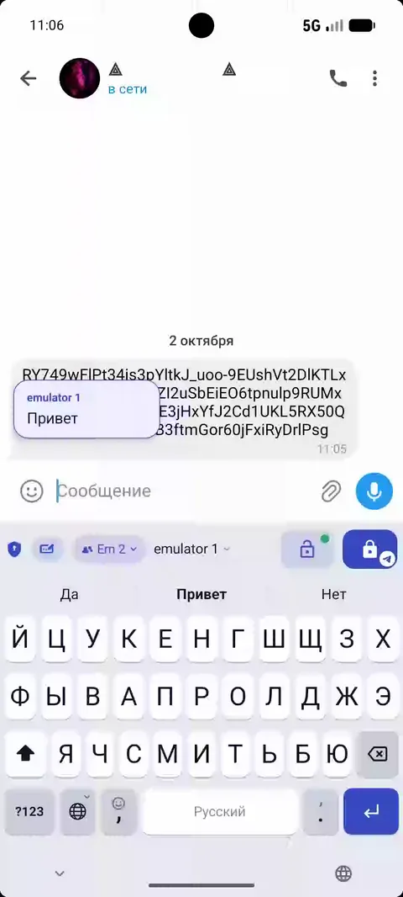

<div align="center">

<picture>
  <source media="(prefers-color-scheme: dark)" srcset="assets/banner-ru-dark.png">
  
</picture>

<sub>[English](README.md) &nbsp;·&nbsp; [Сайт](https://datakeeper.pages.dev/kryptos) &nbsp;·&nbsp; [Новости](https://t.me/KryptosApp) &nbsp;·&nbsp; [Политика конфиденциальности](https://datakeeper.pages.dev/kryptos/privacy)</sub>

<br>

<a href="fastlane/metadata/android/ru-RU/images/phoneScreenshots/1.jpg"></a><a href="fastlane/metadata/android/ru-RU/images/phoneScreenshots/2.jpg"></a><a href="fastlane/metadata/android/ru-RU/images/phoneScreenshots/3.jpg"></a><a href="fastlane/metadata/android/ru-RU/images/phoneScreenshots/4.jpg"></a><a href="fastlane/metadata/android/ru-RU/images/phoneScreenshots/5.jpg"></a>

</div>

# [Kryptos](https://datakeeper.pages.dev/kryptos)

[](https://github.com/swisslite/Kryptos/releases/latest)
[](https://f-droid.org/packages/com.kryptos.android/)
[](LICENSE)
[](#%D0%BF%D0%BE%D0%B4%D0%B4%D0%B5%D1%80%D0%B6%D0%B0%D1%82%D1%8C-%D0%BF%D1%80%D0%BE%D0%B5%D0%BA%D1%82)

Kryptos — приложение для iOS и Android, которое позволяет шифровать сообщения в обычных
мессенджерах. Работает в том числе с теми мессенджерами, где сквозного шифрования нет по умолчанию:
VK, ОК, MAX, Telegram, Instagram, WeChat, а также обычные SMS.

Сообщение можно написать в любом мессенджере и зашифровать кнопкой «замок» на клавиатуре Kryptos.
В поле ввода мессенджера появится шифротекст, который можно отправить.

В Android-версии Kryptos может расшифровать сообщение прямо в чате мессенджера, поэтому не нужно
постоянно открывать Kryptos для расшифрования. В iPhone-версии расшифрованный текст автоматически
отображается в клавиатуре после копирования шифротекста.

Kryptos использует один формат шифротекста на обеих платформах, поэтому отправитель и получатель
могут использовать разные операционные системы.

<p align="center">


</p>

## Возможности

- Системная клавиатура. Kryptos устанавливается как обычная клавиатура и позволяет шифровать текст в поле ввода любого приложения. Клавиатура поддерживает несколько языков, эмодзи, подсказки и автоисправление. Работает без доступа к интернету.
- Расшифрование на Android. Шифротекст, полученный от собеседника, расшифровывается автоматически поверх сообщений в самом мессенджере. По умолчанию специальные возможности отключены.
- Протокол Signal. Для каждого сообщения используется отдельный ключ (SPQR и Triple Ratchet) и защита первого обмена ключами от возможных будущих атак с использованием квантовых компьютеров (PQXDH).
- Обмен ключами. Ключ передаётся собеседнику один раз через QR-код или копированием ключа. Это должен сделать и ваш собеседник. В приложении можно создать несколько профилей.
- Общий пароль. Возможность использовать общий пароль: договориться с человеком о пароле и обмениваться информацией (симметричное шифрование). Также поддерживается PGP.
- Стеганография в изображениях. Скрытие сообщения в изображении.
- Текстовая стеганография. Маскировка под обычный набор слов вместо шифро-мусора. Несколько режимов текстовой стеганографии.
- Выравнивание длины. Сообщение можно дополнить до заданного размера, чтобы длина шифротекста не показывала точную длину исходного сообщения для защиты от сторонних наблюдателей.
- Защита приложения. Для входа можно использовать отпечаток пальца, распознавание лица или отдельный код. Предусмотрен пароль-ловушка: при его вводе приложение не открывается, а ключи, чаты и контакты удаляются.
- Буфер обмена и сообщения. Буфер обмена очищается автоматически. Сообщения можно удалять по таймеру. На Android можно запретить скриншоты.
- Резервное копирование. Все ключи и, по желанию, чаты можно экспортировать в зашифрованный паролем файл и перенести на другое устройство.
- Настройки интерфейса. Поддержка нескольких языков. Светлая и тёмная темы, а также встроенное руководство по использованию с ответами на вопросы.

## Требования

- iOS 17 или новее
- Android 8.0 (API 26) или новее
- Android: `arm64-v8a` или `armeabi-v7a`

## Установка

**F-Droid**: [f-droid.org/packages/com.kryptos.android](https://f-droid.org/packages/com.kryptos.android/).
Приложение собирается в F-Droid из исходного кода и подписывается тем же ключом, что и APK из
Releases. Обновления устанавливаются через F-Droid.

**Android, напрямую**: `Kryptos.apk` из [Releases](../../releases) или с
[сайта](https://datakeeper.pages.dev/kryptos). Файл подписан ключом разработчика, придётся разрешить
установку из неизвестных источников. Обновления ставятся вручную.

**iOS**: `Kryptos.ipa` без подписи, подписать его нужно самому. Способа два:

- если есть сертификат (`.p12` и профиль), откройте `.ipa` в Feather, ESign или Scarlet и
  установите. Инструкции по установке можно найти в интернете;
- если сертификата нет, добавьте [репозиторий в формате AltStore](https://datakeeper.pages.dev/altstore.json)
  в AltStore или SideStore: они подписывают приложение вашим Apple ID. Такая подпись действует 7 дней
  и продлевается кнопкой Refresh в том же приложении.

Обновление подписывайте тем же сертификатом, что и предыдущую установку, иначе меняется группа
доступа к Keychain и приложение запустится как новое. Контрольные суммы SHA-256 публикуются с каждым
релизом и на сайте.

## Как пользоваться

1. Откройте вкладку «Диалоги» и передайте собеседнику свой ключ. Для этого выберите «Мой ключ» → «Показать QR-код» или скопируйте ключ и отправьте собеседнику.
2. Добавьте ключ собеседника через «Добавить контакт».
3. Напишите сообщение в приложении или с помощью клавиатуры Kryptos в мессенджере и зашифруйте его.
4. Отправьте получившийся шифротекст через любой мессенджер.
5. Получатель сможет расшифровать его в приложении, в клавиатуре при копировании или автоматически на экране в чате мессенджера в Android-версии (при включённом расшифровании на экране и с доступом к специальным возможностям).

При использовании общего пароля обмен ключами не требуется. Достаточно договориться о пароле
заранее по защищённым каналам связи или лично.

## Поддержать проект


```
86oyPpT7CitPFQTxWdwYwSZ9BUABib37G9AQeeYd2KRcFfwbamaUiZfJYC8gPrfTCiV2X7K4DC1XFi3cfX6N1d1uUL5s3jh
```


```
UQDrhHMQy8-mZ7pq9KerKAd7QUwjCXjNK-20f0m4yjOkL8jF
```


```
bc1qwsnex9q5ux88fnt93udn2xmf8752mnx4km2rvm
```

## Безопасность

- **Протокол Signal**: библиотека [libsignal](https://github.com/signalapp/libsignal) v0.102.2,
  собираемая из исходного кода на обеих платформах. PQXDH (X3DH с Kyber-1024) для начального
  согласования и Triple Ratchet для переписки. В ключ каждого сообщения подмешивается SPQR,
  постквантовая защита Signal. Подписанные и Kyber-префключи обновляются каждые двое суток,
  отработавшие удаляются через 30 дней.
- **Формат сообщения**: `соль ‖ AES-256-CTR(HKDF-SHA256(pairSecret, соль) → ключ/IV, заголовок ‖
  тело)`, base64url, без префикса и без открытого заголовка. `pairSecret` выводится из общего секрета
  X25519 двух ключей личности, того, что идёт через мессенджер, для снятия маски не хватает. По шифру
  нельзя понять, что он сделан Kryptos. Один и тот же текст каждый раз даёт разный результат. Сжатие
  DEFLATE и выравнивание длины согласуются одним байтом заголовка.
- **Режим пароля**: Argon2id, 64 МиБ, t=3, p=1 (профиль RFC 9106), затем AES-256-GCM с случайной
  солью на каждое сообщение. На iOS это Argon2 от PHC, на Android: Bouncy Castle; обе проверены
  тестовыми векторами и сверены друг с другом.
- **PGP**: ObjectivePGP на iOS, PGPainless и Bouncy Castle на Android.
- **Стеганография в фото**: пиксели-носители выбираются по локальному перепаду яркости в красном и
  зелёном каналах, которые остаются нетронутыми, поэтому обе стороны вычисляют одни и те же позиции.
  Биты пишутся в синий канал методом LSB matching, расстановка берётся из потока HMAC-SHA256, длина
  маскируется. В контейнере нет сигнатур и открытого заголовка.
- **Хранение ключей**: Keychain на iOS с `kSecAttrAccessibleWhenUnlockedThisDeviceOnly`;
  Android Keystore с мастер-ключом AES/GCM: используется StrongBox, если он есть в устройстве, и там,
  где это поддерживается, ключ работает только на разблокированном телефоне.
- **Сеть**: сетевого кода нет ни в одной версии. Манифест Android объявляет только необходимые
  разрешения для работы: разрешения `INTERNET` нет. Аккаунтов, номеров телефона и серверов нет.
- **Сообщить об уязвимости или баге**: Порядок описан в [SECURITY.md](SECURITY.md).
- **Защита на Android**: `FLAG_SECURE` для окон приложения и клавиатуры, отключённое
  персонализированное обучение сторонних клавиатур, защита от tapjacking, пустой `taskAffinity`,
  отключённые резервные копии и перенос между устройствами, сжатие и обфускация R8. Аварийное
  стирание уничтожает мастер-ключ в Keystore, оставшиеся данные расшифровать нельзя.

## Архитектура

```
CipherCore/         Swift-пакет: Argon2id, режим пароля, стеганография, формат сообщения
Kryptos/            приложение для iOS (SwiftUI): чаты, PGP, пароль, стеганография, настройки
KryptosKeyboard/    клавиатура для iOS (расширение) вместе со словарями
android/app/        приложение для Android (Kotlin, Jetpack Compose)
  core/               аналог CipherCore на Kotlin
  signal/ pgp/        службы протокола и хранилища
  keyboard/           клавиатура (IME)
  screen/             служба расшифровки на экране
android/libsignal/  локальный модуль, собирающий libsignal под Android
ThirdParty/         ObjectivePGP (готовый xcframework)
patches/            патч, применяемый к libsignal
scripts/            setup-libsignal.sh
```

Исходники libsignal в репозиторий не входят. Скрипт `scripts/setup-libsignal.sh` клонирует их на
закреплённом теге, применяет `patches/libsignal-v0.102.2-kryptos.patch` (удаление
swift-docc-plugin) и собирает библиотеку.

## Разработка

```bash
scripts/setup-libsignal.sh --ios --android
./build-ipa.sh
cd android && ./gradlew :app:assembleRelease
```

Для сборки libsignal нужны Rust, CMake, protoc и Clang с libclang. Подробные инструкции лежат в
[BUILDING.md](BUILDING.md).

## Лицензия

AGPL-3.0, этого требует libsignal. Текст лицензии в файле [LICENSE](LICENSE).
